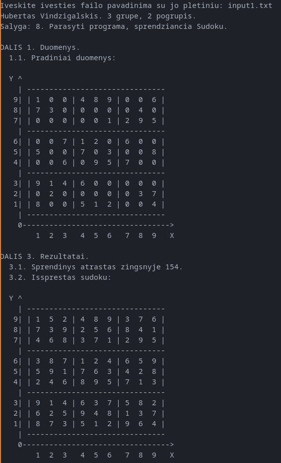
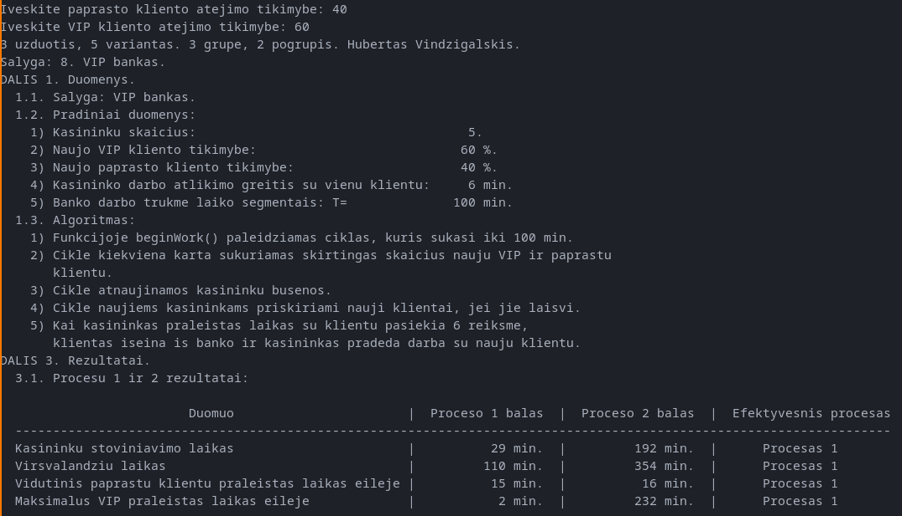

# Algoritmai-duomenu-strukturos

## Demonstration
Sudoku.
Programa, kuri sprendžia pateiktą sudoku:

VIP bankas.
Programa vykdo banko simuliaciją su VIP klientais, kur pirmoji simuliacija vykdoma, kai VIP klientai turi atskirą kasininką, o antroje simuliacijoje visi kasininkai yra bendri (nera atskiro VIP kasininko), bet VIP klientai priimami be eilės:

